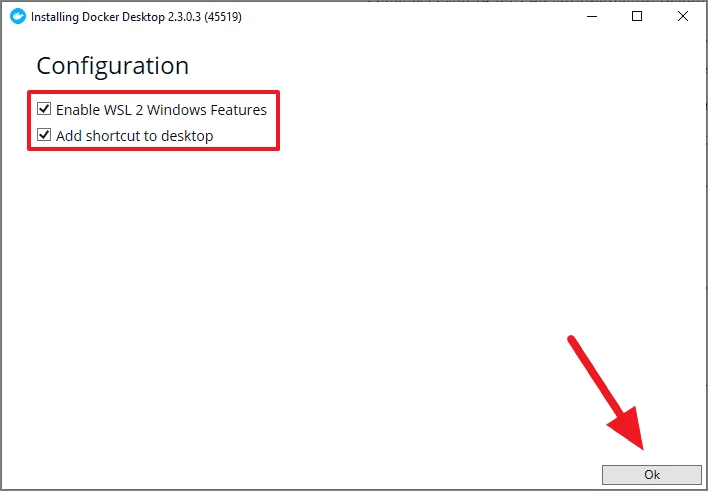
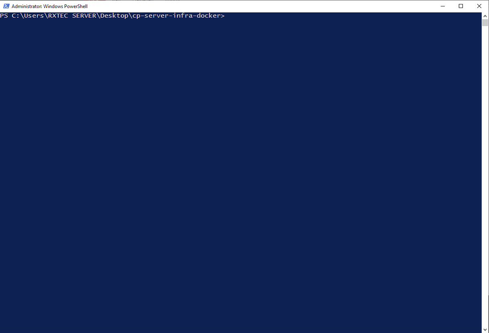
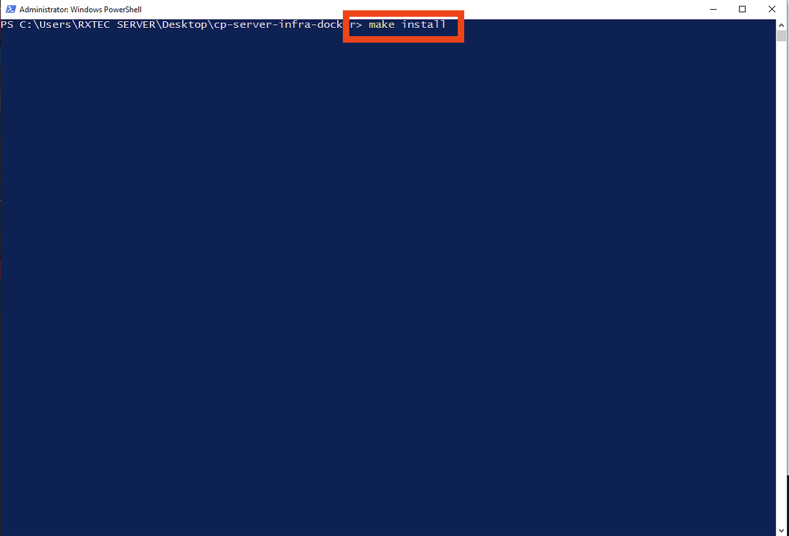

# GHC Control Docker

## Docker Installation auf Windows

Damit das Programm funktioniert, muss zuerst ein anderes Programm namens "Docker" installiert sein.

[Docker](https://www.docker.com/products/docker-desktop) kann auf folgender Website runtergeladen werden:

**https://www.docker.com/products/docker-desktop**

- Klicken Sie auf den "Download for Windows"-Knopf wie im nachstehenden Bild.

Danach wird das Programm Docker heruntergeladen. Sie werden eine Datei namens "Docker Desktop Installer", in Ihrem
Download-Ordner im Explorer finden wie auf folgendem Bild zu sehen ist:

- Mit einem Doppel-Klick auf diese Datei öffnet sich ein Fenster und Sie starten somit den Installationsprozess.

In diesem neuen Fenster gibt es zwei Menüpunkte zum ankreuzen. Achten Sie darauf das **beide** Optionen angelickt haben.
Dies sollte wie folgt aussehen:

Die Installation startet nun nachdem Sie auf **OK** rechts unten geklickt haben.
Nachdem die Installation fertig ist, erscheint in dem Fenster eine Meldung
"Close and Restart".

- Drücken Sie auf dieses Knopf, dies bewirkt, dass Windows neu gestartet wird
und der Installtionsprozess vollständig abgeschlossen wird.

Achten Sie darauf das dass Programm Docker gestartet ist. Klicken Sie mit einem Doppel-Klick auf das Programm, welches nun auf Ihrem
Desktop zu sehen ist. Das Fenster das aufgeht können Sie minimieren oder so lassen wie es ist.

## GHC Control Installation

Da nun Docker installiert ist, muss die eigentliche Software für die Videowall installiert werden.

- Kopieren Sie den gesamten Ordner, welcher das Programm enthält, vom USB-Stick auf Ihren Desktop.

- Navigieren Sie nun in Ihrem Windows-Explorer in den Ordner, welchen Sie eben erst auf den Desktiop kopiert haben. Dies könnte wie
folgt aussehen:

- Drücken Sie nun die Shift-Tast, welche sich auf der Tastatur links über der "STRG"-Taste befindet und machen Sie gleichzeitig einen
rechten Mausklick.

- Nun öffnet sich ein kleines Fenster und Sie müssen auf "PowerShell-Fenster hier öffnen" klicken. Genauer in folgendem
Bild dokumentiert:

- Danach öffnet sich ein Fenster welches folgend aussieht:

- Geben Sie in diesem Fenster nun folgenden Befehl ein und drücken Sie dann die "Enter"-Taste

`make install`

- Warten Sie nun einige Minuten bis das Programm fertig installiert ist.

Wenn die Installation fertig ist, was eine Weile dauern kann, muss am Ende der PowerShell so etwas stehen:

** Starten des Programms

Wenn alle Schritte bis jetzt korrekt ausgeführt worden sind. Können Sie das Programm nun öffnen.

- Dazu 