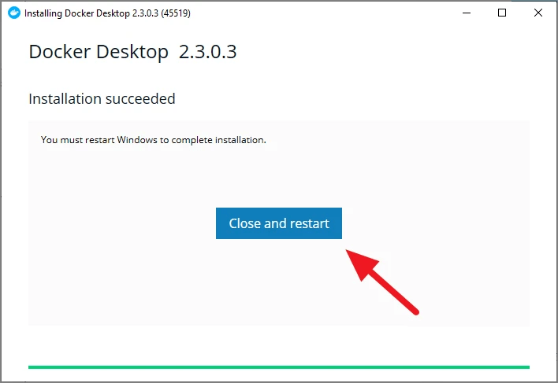
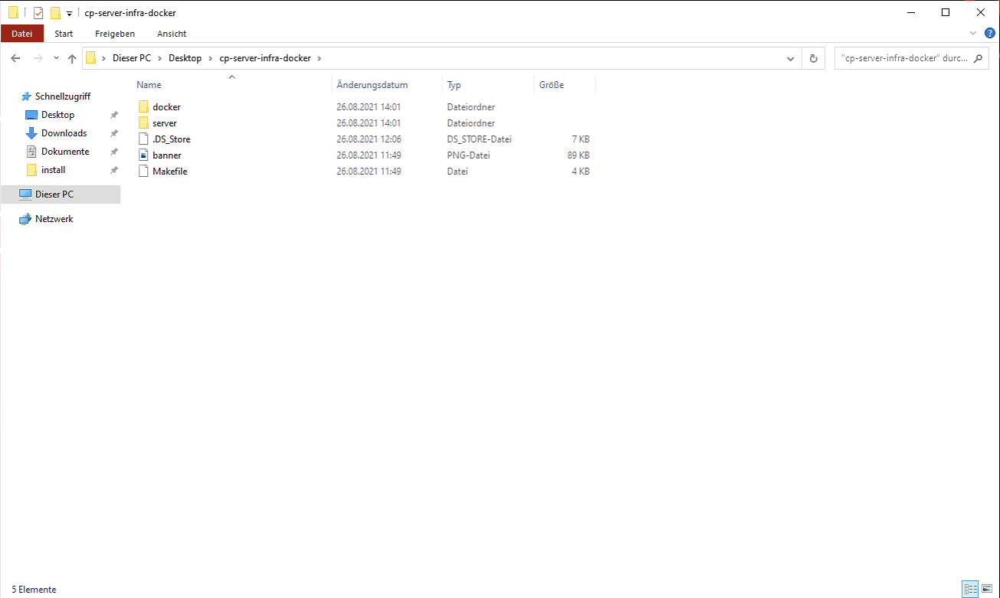
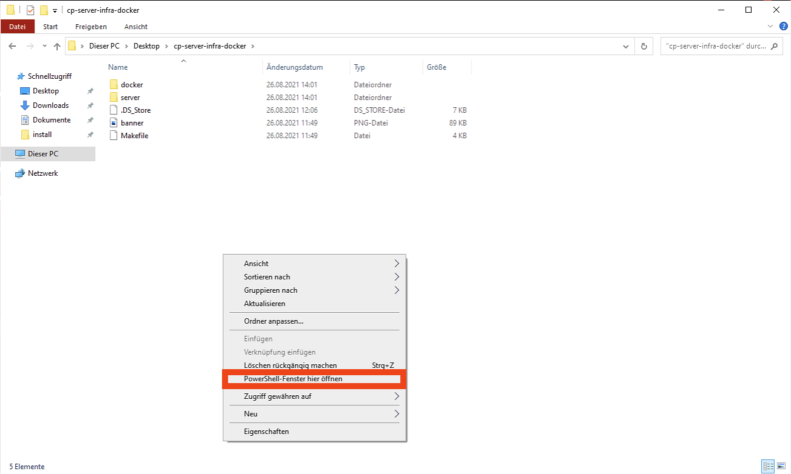

# GHC Control Docker

## Node.js Installation auf Windows

Zuerst muss Node.js auf dem PC installiert werden.

Die Website zum runterladen ist:
**https://nodejs.org/en/download/** oder klicken Sie [hier](https://nodejs.org/en/download/) um direkt auf die Website geleitet zu werden.

- Klicken Sie auf der Website auf den linken Knopf, wie im folgenden Bild markiert, um Node.js herunterzuladen.

Sie finden die Installationsdatei im Windows Explorer unter Downloads wie im folgenden Bild.

- Öffnen Sie die heruntegeladene Datei mit einem Doppelklick.

Folgen Sie nun den Anweisungen des geöffneten Installationsfensters von Node.js. Drücken Sie immer einfach **Next** und stimmen Sie den
AGB zu, bis zu **Install** am Ende gelangen.

Nun wird Node.js installiert, dies kann ein paar Minuten dauern.

- Am Ende klicken Sie auf **Finish** wie im folgenden Bild gezeigt. Danach ist die Installation zu Node.js abgeschlossen.

## Yarn Installation

Als zweites muss ein Tool namens **Yarn** installiert werden.

- Um dies zu tun drücken Sie bitte **STRG + R** gleichzeitig.

- Es öffnet sich ein Fenster links unten im Bildschirm, geben Sie hier den Text `cmd` ein und drücken Sie dann **Enter**:

- Es öffnet sich ein Fenster. Hier tippen Sie den Befehl `npm install --global yarn` ein und drücken dann **Enter**.

- Das Programm wird nun installiert. Wenn es richtig installiert worden ist, sieht der Inhalt des Fensters folgendermaßen aus:

## Docker Installation auf Windows

Als drittes muss ein Programm namens "Docker" installiert werden.

Docker kann auf folgender Website runtergeladen werden:

**https://www.docker.com/products/docker-desktop** oder klicken Sie [hier](https://www.docker.com/products/docker-desktop) um direkt auf die Website geleitet zu werden.

- Klicken Sie auf den "Download for Windows"-Knopf wie im nachstehenden Bild.

Danach wird das Programm Docker heruntergeladen. Sie werden eine Datei namens "Docker Desktop Installer", in Ihrem
Download-Ordner im Explorer finden wie auf folgendem Bild zu sehen ist:

- Mit einem Doppel-Klick auf diese Datei öffnet sich ein Fenster und Sie starten somit den Installationsprozess.

In diesem neuen Fenster gibt es zwei Menüpunkte zum ankreuzen. Achten Sie darauf das **beide** Optionen angelickt haben.
Dies sollte wie folgt aussehen:

Die Installation startet nun nachdem Sie auf **OK** rechts unten geklickt haben.
Nachdem die Installation fertig ist, erscheint in dem Fenster eine Meldung
"Close and Restart".

- Drücken Sie auf dieses Knopf. Dies bewirkt, dass Windows neu gestartet wird
und der Installtionsprozess vollständig abgeschlossen wird.

Achten Sie darauf das dass Programm Docker nach dem Neustart des Systems gestartet ist. Klicken Sie mit einem Doppel-Klick auf das Programm, welches nun auf Ihrem
Desktop zu sehen ist. Das Fenster das aufgeht, können Sie minimieren oder so lassen wie es ist.

## GHC Control Installation

Da nun Docker installiert ist, muss die eigentliche Software für die Videowall installiert werden.

- Kopieren Sie den gesamten Ordner, welcher das Programm enthält, vom USB-Stick auf Ihren Desktop.

- Navigieren Sie nun in Ihrem Windows-Explorer oder über den Desktop mit einem Doppel-Klick in den Ordner, welchen Sie eben erst auf den Desktop kopiert haben. Dies könnte wie folgt aussehen:

- Drücken Sie nun die `Shift-Taste`, welche sich auf der Tastatur links über der "STRG"-Taste befindet und machen Sie gleichzeitig einen
rechten Mausklick irgendwo auf den weißen Hintergrund im Explorer wie er im oberen Bild zu sehen ist.

- Nun öffnet sich ein kleines Fenster und Sie müssen auf "PowerShell-Fenster hier öffnen" klicken. Genauer in folgendem
Bild dokumentiert:

- Danach öffnet sich ein Fenster welches folgend aussieht:

- Geben Sie in diesem Fenster nun den Befehl `make install` ein und drücken Sie dann die "Enter"-Taste.

- Warten Sie nun einige Minuten bis das Programm fertig installiert ist.

Wenn die Installation fertig ist, was eine Weile dauern kann, muss am Ende der PowerShell so etwas stehen:

## Starten des Programms

Wenn alle Schritte bis jetzt korrekt ausgeführt worden sind, können Sie das Programm nun öffnen.

- Dazu öffnen Sie einen Browser Ihrer Wahl, wie zum Beispiel Google Chrome oder Edge, und tippen oben in die Adressleiste
des Browsers folgendes ein:

`localhost`

Nun könnte es ein paar Sekunden bis zu einer Minute dauern, dann hat das Programm im Browser geladen und wurde richtig installiert.